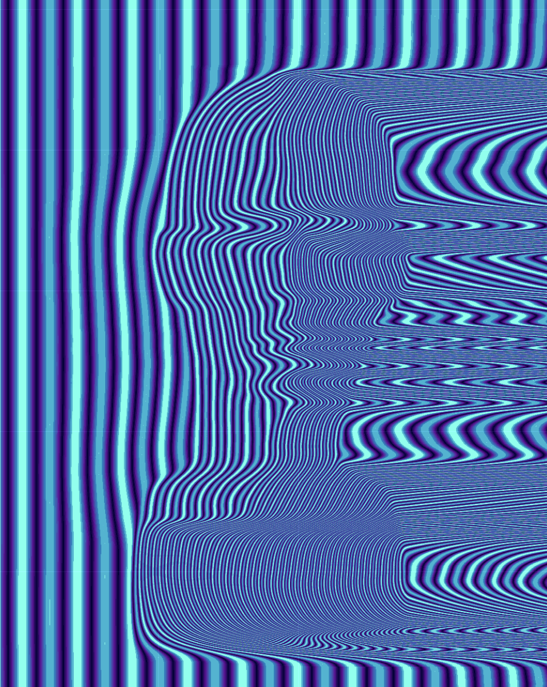
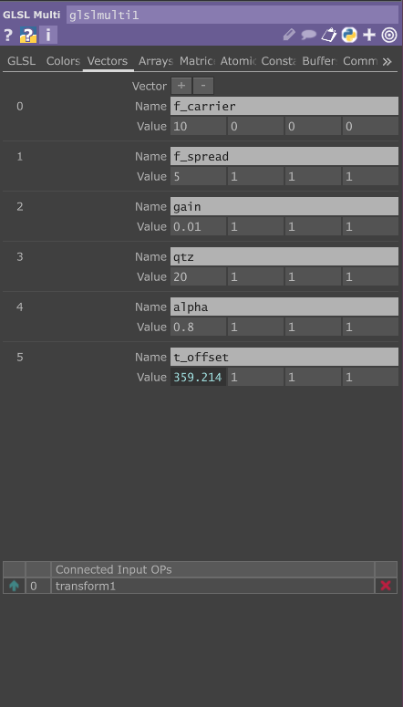
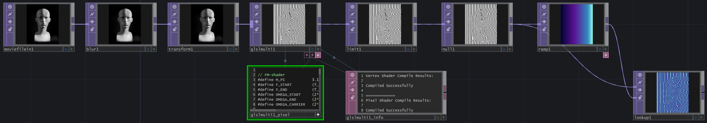

# GLSL Frequency Modulation Frag Shader

## TouchDesigner Setup

> 1. **Create a GLSL TOP** or GLSL Multi TOP, and paste the fragment shader code from the `fm-glsl.frag` file.

> 2. **Create the following vectors** in the GLSL TOP. You can set `t_offset` to `absTime.seconds` to add movement.

> 3. **Connect an input TOP** to the GLSL TOP (this can be an image, a blurred image, or anything you like).

> 4. **Have fun!** Play around and experiment by changing the vector values.

## Example Network

The example file is available under the `example-td-network` folder.

